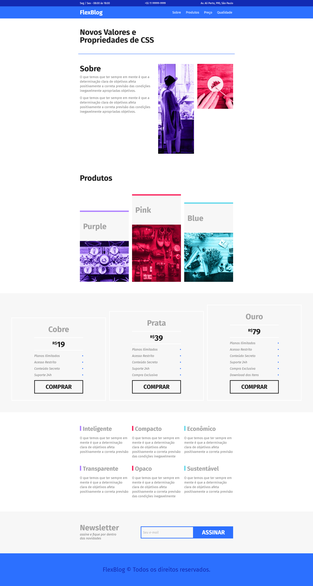

# FlexBlog 

> Exemplo de página inicial de um blog feita toda utilizando Flexbox.

### Ajustes e melhorias

Projeto concluído!

- [x] Desenvolvimento da página utilizando somente Flexbox
- [x] Implementação responsiva

## 💻 Pré-requisitos

Antes de começar, verifique se você atendeu aos seguintes requisitos:

* Você instalou a versão mais recente de `Node.js`.

## 🚀 Instalando FlexBlog

Para instalar o FlexBlog, siga estas etapas:

* Clone esse repositório com `git clone https://github.com/gguilhermelopes/flexblog`
* Utilze uma extensão como a Live Server do VSCode em sua IDE para melhor visualização do site localmente

## ☕ Usando FlexBlog

Para usar FlexBlog, siga estas etapas:

* Abra o seu Live Server!
